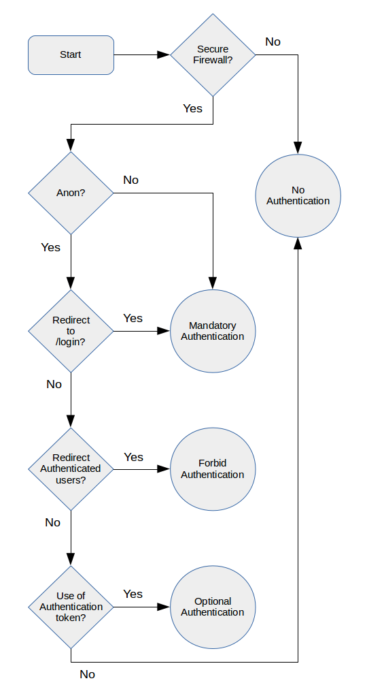

# Firewall Migration

This document describes the procedure for modifying a Radvance app to specify
its own firewalls when it previously relied on firewalls specified by Radvance.

## Why do this?

It is the application that ought to specify the firewalls it uses, not
Radvance, because the app needs greater control over its firewall
configuration.  The firewalls specified by Radvance are designed to cover a
broad use case and are sub-optimal as a result.  For example, authentication is
optional in the 'default' Radvance firewall and its pattern covers the entire
routing space; this has resulted in unnecessary hacks to secure application
controllers.

## Preliminaries

### Upgrade Radvance

If possible, upgrade Radvance to a version at or later than 1.39.0.  If it
isn't possible to upgrade Radvance then you will override Radvance's
`BaseWebApplication::configureSecurity` method in Step 3 of the procedure.

### Install this repo into the app

Before installing this tool into the app, it is a good idea to commit any
changes to `composer.json` and `composer.lock`.  Doing this will make it much
easier to uninstall this repo from the app than relying on Composer (which is
deficient in this respect).

    $ cd path/to/app
    $ composer require --dev radvance/migrate-fw

## Summary of Procedure

1. Identify existing firewall configuration
2. Categorise Routes by authentication requirements
3. Construct firewalls and override BaseWebApplication::getFirewalls
4. Remove extraneous code
5. Test firewalls

## Procedure in detail

### 1. Identify existing firewall configuration

Identify firewall configuration specified by the app and by Radvance.  The
likelihood of finding configuration in the app is low, but will be found in the
app/config/parameters.yml file, in the application bootstrap (often at
app/bootstrap.php) or in the Application class (usually src/Application.php).
Radvance's firewall configuration will be found in
vendor/radvance/radvance/src/Framework/BaseWebApplication.php

Make a list of path patterns covered by each firewall and whether or not each
firewall requires users to authenticate.  A firewall which requires
authentication is one which specifies an authentication provider setting, e.g.
`http`, `form`, `x509`, etc. and does not specify `anonymous: true` or disable
security with `security: false`.

By way of example:-

    'api' => [
        'pattern' => '^/api',
        'http' => [...],
    ],
    'admin' => [
        'pattern' => '/^admin',
        'form' => [...],
    ],
    'login' => [
        'pattern' => '^/login$',
    ],
    'test' => [
        'pattern' => '/^testarea',
        'form' => [...],
        'security' => false,
    ],
    'default' => [
        'pattern' => '^/',
        'form' => [...],
        'anonymous' => true,
    ],

could be noted like this:

    +----------+-----------+----------------+
    | security | anonymous | path           |
    +----------+-----------+----------------+
    | yes      | no        | ^/api          |
    | yes      | no        | ^/admin        |
    | no       | -         | ^/login$       |
    | no       | -         | ^/testarea     |
    | yes      | yes       | ^/             |
    +----------+-----------+----------------+

The order in which firewalls are declared has significance: the path requested
is matched against firewall patterns in the order that they appear.  Therefore,
a request for /api/v3 will be handled by the api firewall in the above example.
Note also that there may be more than one set of firewall configuration with
only one of them active at any time - the active set being decided by some
setting.  Make note of each set separately for use in the next step.

### 2. Categorise Routes by Authentication Requirements

The next step is to inspect the application and categorise its routes by
whether or not they are accessible to unauthenticated users:-

- Forbid authentication: authenticated users are denied access.  Such a route
  may or may not be covered by a firewall; it will redirect authenticated users
  elsewhere or perhaps throw some kind of exception (e.g. a 404).  This is
  an uncommon pattern.

- No authentication: access is permitted to any user, authenticated or not.
  Such a route may either not be covered by a firewall, or covered by a
  firewall which does not specify an authentication provider.

- Optional Authentication: access is permitted to any user, authenticated or
  not, but the code expects users to at least be "anonymously authenticated"
  (in Symfony parlance).  Such a route will be covered by a firewall which does
  specify an authentication provider, but also specifies `anonymous: true`.
  There will not be any ~~hacks~~ code which redirects anonymously
  authenticated users to a login page.

- Mandatory Authentication: only authenticated users are permitted access.
  Such a route will be covered by a firewall which does specify an
  authentication provider and either does not specify `anonymous: true` or does
  specify `anonymous: true` along with ~~hacks~~ code to redirect anonymously
  authenticated users to a login page.

This repository provides a tool to dump a list of the app's routes, as
specified by the app itself and by the Radvance framework, to make inspecting
the routes a bit easier.  Run it thus:-

    $ cd path/to/app
    $ vendor/bin/routes d:r --show-controllers

The output shows the route name, path and controller name.

Answer the following questions for each path to decide to which category a
route belongs and add it to a list of route paths for the category.

1. If the path is not covered by an existing firewall configuration or is
   covered by one which does not require authentication (no security) then the
   category is No Authentication.  Otherwise, answer the next question.

2. If the firewall config does not specify `anonymous: true` then the category
   is Mandatory Authentication.  Otherwise answer the next question.

3. If there exists code (i.e. in Radvance's BaseWebApplication, in the
   application bootstrap, the Application.php or the route's controller) which
   redirects un-authenticated users to a login page then the category is
   Mandatory Authentication.  Some examples of code that performs such a
   redirection are:-

        # in some controller
        if (!isset($app['current_user'])) {
            return $app->redirect($app['url_generator']->generate('login'));
            // alternatively: throw new AuthenticationException;
        }

        # in a call to $app->before()
        if (false !== strpos($request->getUri(), '/admin')
            && !isset($app['current_user'])
        ) {
            return $app->redirect($app['url_generator']->generate('login'));
        }

    You can quickly determine whether such a redirect is in place using cURL:-

        $ curl -i <url>

    If the response header shows a redirect to a login page then you may want to
    find the code responsible for your future reference: the code may apply to
    multiple paths (unless you find it in the controller) and this code can be
    removed once migration of the firewalls is complete.

    Otherwise, answer the next question.

4. If there exists code (in the same places as the previous question) which
   prevents authenticated users from accessing the route (e.g. redirects
   elsewhere or throws an exception) then the category is Forbid
   Authentication.  Otherwise, answer the next question.

5. If there exists code (in a template or in the same places as question 3)
   which unconditionally makes use of token storage then the category is
   Optional Authentication.  Examples of code which expect to be able to make
   use of token storage are:-

        # in a php file
        $app['security.token_storage']->getToken()->getUser();

        # also in a php file
        if ($app['security.authorization_checker']->isGranted('ROLE_ADMIN')) {
        ...
        }

        # in a template
        
        ...
        

    Otherwise the category is No Authentication.

These questions are summarised in the following flow chart.

### 3. Construct firewalls and override BaseWebApplication::getFirewalls

Construct one firewall configuration for each set of categorised routes.  Use
the route paths to formulate a firewall pattern which matches all of the paths
and add the authentication settings.

For example, let us say we began with the standard Radvance firewalls (taken
from BaseWebApplication's `configureSecurity` or `getFirewalls`):-

    'api' => [
        'stateless' => true,
        'anonymous' => false,
        'pattern' => '^/api',
        'http' => true,
        'users' => $this['security.provider'],
    ],
    'default' => [
        'anonymous' => true,
        'pattern' => '^/',
        'form' => [
            'login_path' => $this->getFirewallsLoginPath(),
            'check_path' => $this->getFirewallsLoginCheckPath(),
        ],
        'logout' => [
            'logout_path' => $this->getFirewallsLogoutPath(),
        ],
        'users' => $this['security.provider'],
    ]

And we have categorised routes:-

    # No Authentication
    /robots.txt
    /favicon.ico
    /exit
    /.{postfix}
    /

    # Forbid Authentication
    (none)

    # Optional Authentication
    /status

    # Mandatory Authentication
    /dashboard
    /v1/resources/{resourceKey}
    /{accountName}/{baseName}
    /{accountName}/{baseName}/config
    /{accountName}/{baseName}/fetchfiles
    /{accountName}/{baseName}/view
    /{accountName}/{baseName}/config/filebridge

First we want to create a no-security firewall for those routes in the No
Authentication category.  We shall name the firewall 'public':-

    # src/Application.php
    protected function getFirewalls()
    {
        return [
            'public' => [
                'pattern' => '^/(robots\.txt|favicon\.ico|exit|\..+|)$',
            ],
        ];
    }

Next we create a firewall for the Optional Authentication routes.  Originally
this path would have been handled by Radvance's 'default' firewall and so we
want to keep using the same authentication provider as that firewall and,
because we are creating a firewall for optional auth, we also retain
`anonymous: true`:-

            'public_and_private' => [
                'pattern' => '^/status',
                'anonymous' => true,
                'form' => [
                    'login_path' => $this->getFirewallsLoginPath(),
                    ...
                ...
            ],

Next we create a firewall for the Mandatory Authentication routes.  Again this
should work in the same way as Radvance's 'default' firewall, but this time we
don't need `anonymous: true`.  Let's keep the name 'default':-

            'default' => [
                'pattern' => '^.*$',
                'form' => [
                    'login_path' => $this->getFirewallsLoginPath(),
                    ...
                ...
            ],

We have split the original 'default' firewall into three, based on the
requirements for authentication, but notice how two of them use the same
authentication provider setup.  Ideally, we want to treat the
'public_and_private' and 'default' firewalls as one - we certainly don't want
the user to have to re-authenticate when navigating between routes of different
firewalls.  Thus, we need a shared firewall context for them.  The final result
looks like this:-

    # src/Application.php
    protected function getFirewalls()
    {
        return [
            'public' => [
                'pattern' => '^/(robots\.txt|favicon\.ico|exit|\..+|)$',
            ],
            'public_and_private' => [
                'context' => 'public_and_private_plus_default',
                'pattern' => '^/status',
                'anonymous' => true,
                'form' => [
                    'login_path' => $this->getFirewallsLoginPath(),
                    'check_path' => $this->getFirewallsLoginCheckPath(),
                ],
                'logout' => [
                    'logout_path' => $this->getFirewallsLogoutPath(),
                ],
                'users' => $this['security.provider'],
            ],
            'default' => [
                'context' => 'public_and_private_plus_default',
                'pattern' => '^.*$',
                'form' => [
                    'login_path' => $this->getFirewallsLoginPath(),
                    'check_path' => $this->getFirewallsLoginCheckPath(),
                ],
                'logout' => [
                    'logout_path' => $this->getFirewallsLogoutPath(),
                ],
                'users' => $this['security.provider'],
            ],
        ];
    }

Finally, note that we had no routes with paths beginning `/api` and so we do
not need the Radvance's api firewall and have omitted it from our new set.

### 4. Remove extraneous code

Extraneous code can be removed after the new firewalls are in place.  Code
which can be removed is that which redirects unauthenticated users to a login
page, like the examples given in Step 2, Question 3.

### 5. Test firewalls

With the new firewalls in place, it is time to test the firewalls to ensure
that routes have not been erroneously omitted from or included in a firewall.

Make a request for each route in each category from Step 2 and check that the
behaviour matches the authentication requirements:-

- Authentication Forbidden: You should be able to request the path when not
  authenticated, but denied access after logging in.

- No Authentication: You should be able to request the path when not
  authenticated and also after logging in.

- Optional Authentication: You should expect the same behaviour as with No
  Authentication, but there may be some indication that you are logged in (such
  as a link to your account settings, your name displayed, etc.).

- Mandatory Authentication: You should be redirected to a login page when not
  authenticated and permitted to access the path after logging in.

Commit the changes once you have confidence in the correctness of the firewalls.

## Conclusion

Remove this repo from the app.  If you took the time in the preliminary stage
of this process to commit any changes to `composer.json` and `composer.lock`
before you installed this repo then removing this repo is as simple as:-

    $ cd path/to/app
    $ git checkout -- composer.json composer.lock
    $ rm -rf ./vendor
    $ composer install

Otherwise it is a bit trickier because Composer is apt to update unrelated
dependencies with the following command:-

    $ cd path/to/app
    $ composer remove --dev radvance/migrate-fw
